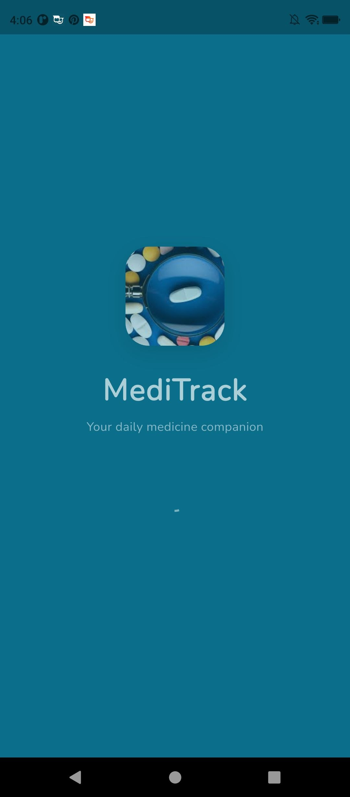
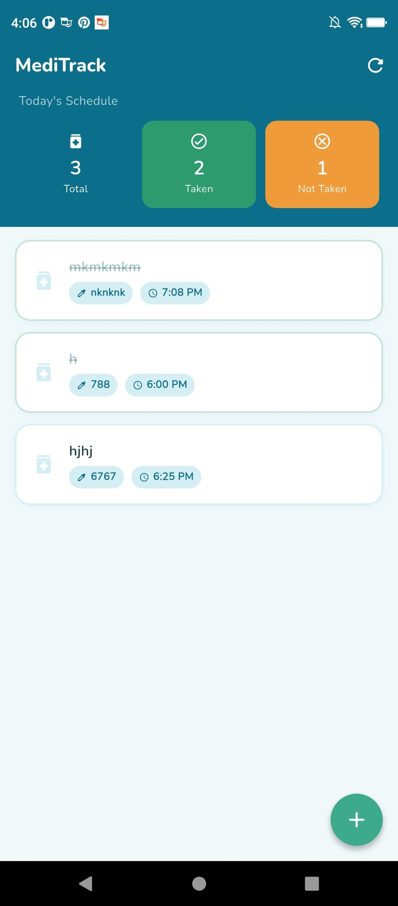
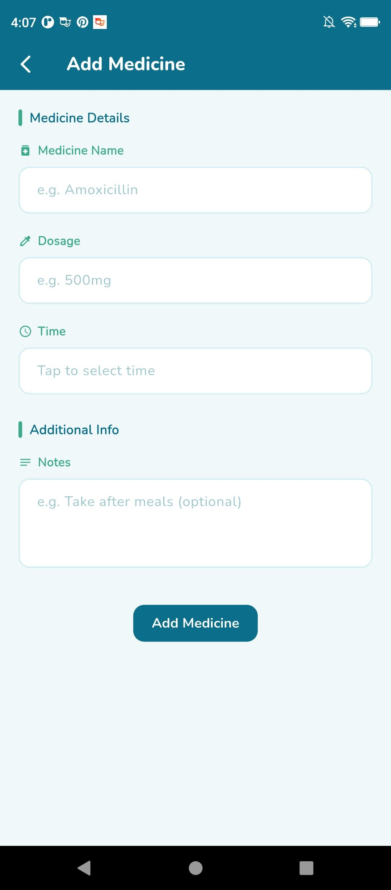
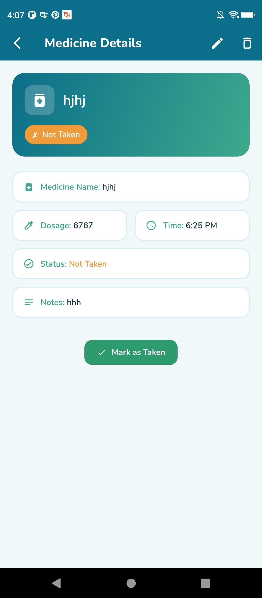
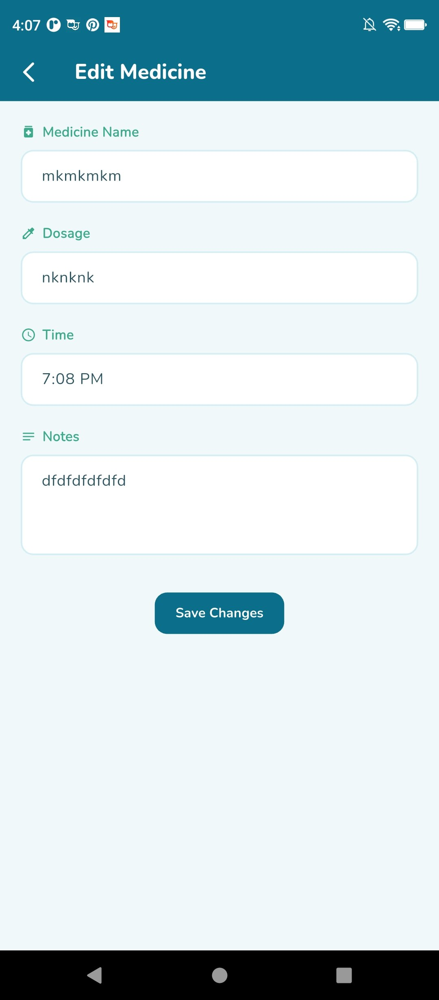
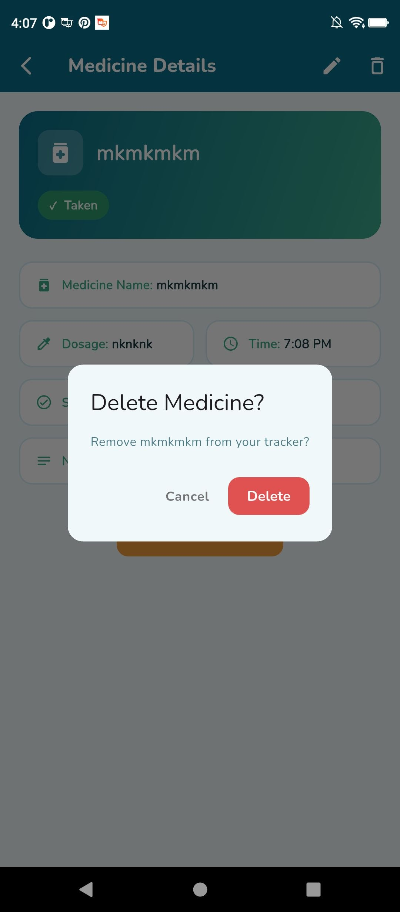

# MediTrack — Medicine Tracker App

A Flutter application for tracking daily medicines using **BLoC state management** and **Dio** for HTTP requests .

---

## Screenshots

## Author

**[wengelle yohannes . ugr/2568/16 . sec 2]** — MediTrack · Flutter Assignment

## Screenshots

### intro Screen



### medicine list Screen



### medicine details , creating, editing and deletion






---

## Features

| **CREATE** Add medicines with name, dosage, time, and optional notes

| **READ** View full medicine list with live status on home screen

| **UPDATE** Edit any medicine detail or toggle Taken/Not Taken status

| **DELETE** |Remove medicines with a confirmation dialog

---

## Tech Stack

| Layer            | Technology            |
| ---------------- | --------------------- |
| State Management | `flutter_bloc ^8.1.4` |
| HTTP Client      | `dio ^5.4.0`          |
| Models           | `equatable ^2.0.5`    |
| Fonts            | `google_fonts ^6.1.0` |
| Backend          | MockAPI.io            |

---

---

---

## BLoC Architecture

```
UI (Pages/Widgets)
      │
      │  dispatches Events
      ▼
 MedicineBloc
      │
      │  emits States
      ▼
UI rebuilds via BlocBuilder / BlocConsumer

Events:                    States:
─────────────────────      ──────────────────────────────────
LoadMedicines         →    MedicineInitial
AddMedicine           →    MedicineLoading
UpdateMedicine        →    MedicineLoaded(medicines)
DeleteMedicine        →    MedicineOperationSuccess(medicines, message)
ToggleMedicineStatus  →    MedicineError(message)
```

---

---

---
